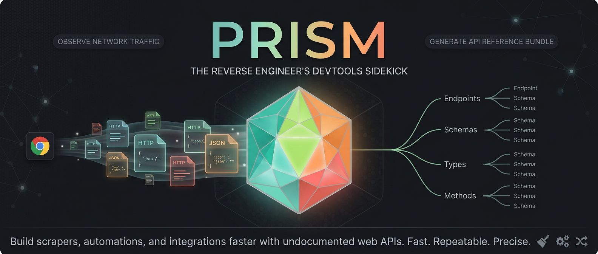
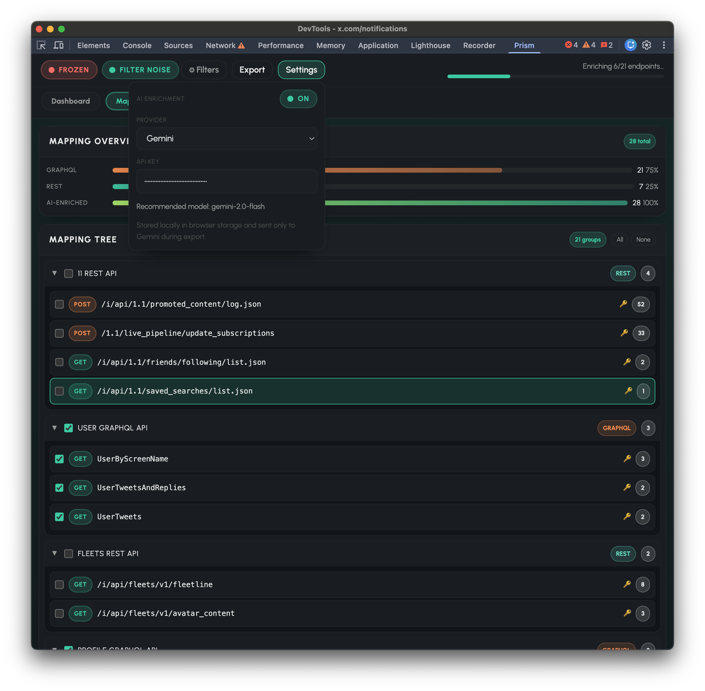

<p align="center">
  
</p>

# Prism

Prism is a Chrome DevTools extension that observes network traffic while you browse and generates a structured API reference bundle.

It exists to make reverse-engineering undocumented web APIs faster and repeatable for developers building scrapers, automations, or integrations.

## UI Screenshot



## What Prism Does

Prism is built around mapping, not dumping.

- It deduplicates repeated requests into endpoint-level entries.
- It infers request and response schemas from multiple observations.
- It exports a clean bundle you can hand to a coding agent.
- It can optionally enrich that bundle with AI-generated endpoint explanations at export time.

Prism does not export raw request/response payload dumps in the structured bundle.

## Who It's For

- Developers and technical users
- People reverse-engineering undocumented web APIs
- Teams building internal/external automations, scrapers, and integrations

## How It Works

1. Open Chrome DevTools and switch to the `Prism` panel.
2. Browse the target site as usual.
3. Prism records relevant network calls and builds normalized endpoint mappings.
4. Export a structured bundle from the panel.

The bundle contains:

- `endpoints.json`: deduplicated endpoint index with inferred request schema and response references
- `responses.json`: shared response schema library referenced by `responseRef`
- `PRISM_MAP.md`: instructions for navigating the bundle

## Install

Download `prism-x.x.x-chrome.zip` from the [latest release](https://github.com/gladium-ai/prism/releases/latest), unzip it, open `chrome://extensions`, enable **Developer Mode**, and click **Load unpacked**.

## Local Setup (WXT)

### Prerequisites

- Node.js and npm

### Install and run

```bash
npm install
npm run dev -- --browser chrome
```

Then load the extension in Chrome:

1. Open `chrome://extensions`.
2. Enable **Developer mode**.
3. Click **Load unpacked** and select `.output/chrome-mv3-dev`.
4. Open any site, open DevTools, and use the `Prism` panel.

### Build

```bash
npm run build
```

## AI Enrichment (Optional)

Prism can enrich exports with plain-language endpoint metadata.

1. Open `Prism` panel -> `Settings`.
2. Toggle **AI Enrichment** on.
3. Choose a provider (`OpenAI`, `Gemini`, or `Anthropic`) and paste an API key.
4. Export the structured bundle.

With AI enrichment enabled, Prism adds endpoint descriptions, auth notes, semantic grouping, field annotations, and a capabilities summary to the export.

If AI enrichment is enabled but no API key is set (or provider calls fail), Prism still exports the bundle without enrichment.
